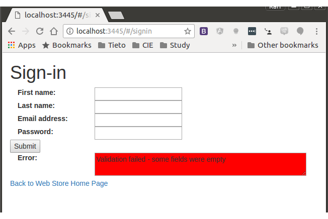

# Simple Frontend

## Introduction

Simple Frontend is a simple frontend for demonstrating how to create a Single Page Application (SPA) using [ClojureScript](https://clojurescript.org/) and [Reagent](https://reagent-project.github.io/).


## Techical Description

The Simple Frontend is a [ClojureScript](http://clojurescript.org) application which uses the [Reagent](http://reagent-project.github.io/index.html) framework which provides the ClojureScript integration for the [React](https://reactjs.org/) JavaScript library.

# Development Instructions

## Creating the Project

We are using the [reagent-frontend](https://github.com/reagent-project/reagent-frontend-template) [Leiningen](https://leiningen.org/) plugin to create the initial Reagent project:

```bash
lein new reagent-frontend simple-frontend

```


## Development

### Figwheel

To start the [Figwheel](https://github.com/bhauman/lein-figwheel) compiler, navigate to the project folder and run the following command in the terminal:

```bash
lein figwheel
```

Figwheel will automatically push cljs changes to the browser.
Once Figwheel starts up, you should be able to open the `public/index.html` page in the browser.

You can also open browser in url: http://localhost:3449/


### Connecting Cursive to Figwheel REPL

See detailed instructions in [Johan Haleby' article](http://code.haleby.se/2017/02/24/connect-cursive-to-figwheel-repl/).


First configure project.clj to provide remote repl in port 7045:

```clojurescript
  :figwheel {:http-server-root "."
             :server-port      3445                         ;; default is 3449
             :nrepl-port       7045                         ;; default is 7002
```

- Start Figwheel REPL in terminal as instructed above.
- Check the port Figwheel provides nREPL, e.g.: "Figwheel: Starting nREPL server on port: 7045".
- In Cursive: Create new Run configuration: Clojure REPL / Remote:
-- Host: localhost
-- Port: 7045
- Start the remote REPL in Cursive.
- In REPL:
-- Choose cljs (default is clj).
-- (use 'figwheel-sidecar.repl-api)
-- (cljs-repl)
-- You should now see the same Figwheel text as in terminal
-- Open browser: http://localhost:3449
-- In Cursive remote REPL: 
--- (simplefrontend.signin/submit-form "Jeppe" "Virtanen" "jeppe.virtanen@tieto.com" "pass")
--- You now should see the logging in browser console (open it in Chrome: Ctrl-Shift-i).
--- So, you are now able to test your functions that are running in browser using Cursive REPL.


### Solving Figwheel Issues

I tried to change the default Figwheel server port 3449 to 3445 (in order to run some other examples in default port 3449):

I thought that I had do

```clojurescript
  :figwheel {:http-server-root "."
             :server-port      3445                         ;; default is 3449
             :nrepl-port       7045
...
  :cljsbuild {:builds
              {:app
               {:source-paths ["src" "env/dev/cljs"]
                :compiler
                ...
                :figwheel
                              {:on-jsload       "simplefrontend.core/mount-root"
                               :websocket-url  "ws://localhost:3445/figwheel-ws"
                               }
                }
```

 but the browser complained

```
socket.cljs?rel=1523021762398:71 WebSocket connection to 'ws://localhost:3449/figwheel-ws/app' failed: Error in connection establishment: net::ERR_CONNECTION_REFUSED
```

I tried to solve this issue for a long time (thought that my Figwheel was misconfigurated). Finally I asked help in [Clojurians Slack Beginners channel](https://clojurians.slack.com/). The problem was not my Figwheel configuration but browser cache. 

So, if you have some odd issues related to your ClojureScript setup, try this first:

1. Check your ClojureScript / Figwheel configuration once more.
2. lein clean
3. Clean browser cache.
4. lein figwheel
5. Try your application again in browser.


### Solving Other Application Development Issues

If you have some weird issues - try to reload the application in Browser.


## Building for Production

```
lein clean
lein package
```

## Frontend Development Observations

Sign-in page ( [signin.cljs](https://github.com/karimarttila/clojure/blob/master/clj-ring-cljs-reagent-demo/simple-frontend/src/simplefrontend/signin.cljs) ) was my first real ClojureScript page I implemented for the SPA. I didn't worry about CSS styles since I'm not artistic and our corporation usually provides some graphical designer who creates the styles for HTML pages - so I only focused on getting the functionality right. I'm an old backend developer and I don't have that much experience implementing frontends. I have implemented one SPA using Javascript/Angular and now after the first SPA page using ClojureScript/Reagent I feel that ClojureScript was somehow easier to work with and code readability is also a lot better. 

Some example screenshots of the page:

Validation failed:





Server accepted sign-in:


