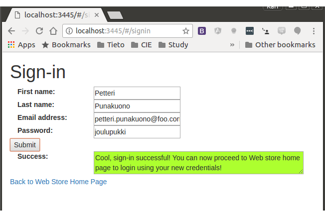
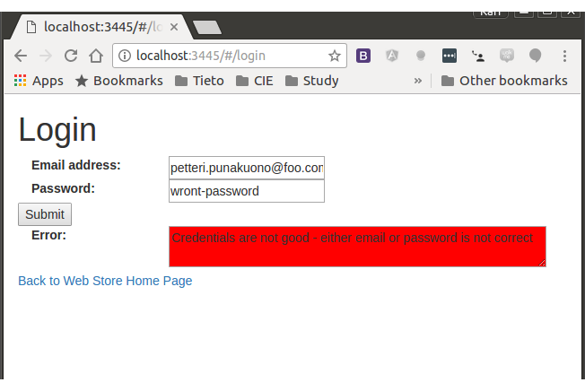
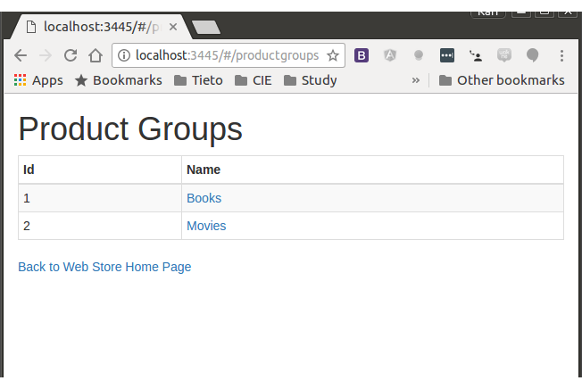
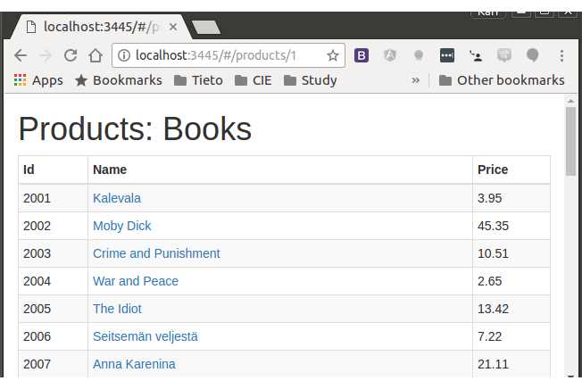
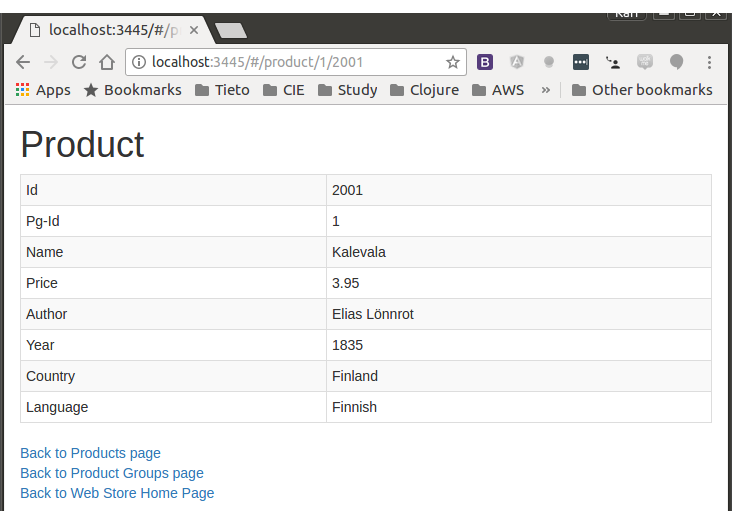

# Simple Frontend

## Table of Contents

  * [Table of Contents](#table-of-contents)
  * [Introduction](#introduction)
  * [Techical Description](#techical-description)
  * [Development Instructions](#development-instructions)
     * [Creating the Project](#creating-the-project)
     * [Figwheel](#figwheel)
     * [Connecting Cursive to Figwheel REPL](#connecting-cursive-to-figwheel-repl)
     * [Solving Figwheel Issues](#solving-figwheel-issues)
     * [Solving Other Application Development Issues](#solving-other-application-development-issues)
  * [Building and Deployment for Production](#building-and-deployment-for-production)
     * [Build Production Version](#build-production-version)
     * [Deploy Production Version](#deploy-production-version)
  * [Simple Frontend Application Structure](#simple-frontend-application-structure)
     * [Sign-in Page](#sign-in-page)
     * [Login Page](#login-page)
     * [Product Groups Page](#product-groups-page)
     * [Products Page](#products-page)
     * [Product Info Page](#product-info-page)
  * [Simple Frontend Development Next Steps](#simple-frontend-development-next-steps)


## Introduction

Simple Frontend is a simple frontend for demonstrating how to create a Single Page Application (SPA) using [ClojureScript](https://clojurescript.org/) and [Reagent](https://reagent-project.github.io/). The Simple Frontend application is a hypothetical web store which sells books and movies.

**Disclaimer**: I didn't worry about CSS styles since I'm not artistic and our corporation usually provides some graphical designer who creates the styles for HTML pages - so I only focused on getting the frontend functionality right. The UI look and feel is horrific, I know, don't worry about that, relax and have a home brew.


## Techical Description

The Simple Frontend is a [ClojureScript](http://clojurescript.org) application which uses the following libraries:

- [Reagent](http://reagent-project.github.io/index.html) framework which provides the ClojureScript integration for the [React](https://reactjs.org/) JavaScript library
- [Secretary](https://github.com/gf3/secretary) which provides client side routing for the Single Page Application.


## Development Instructions

### Creating the Project

I am using the [reagent-frontend](https://github.com/reagent-project/reagent-frontend-template) [Leiningen](https://leiningen.org/) plugin to create the initial Reagent project:

```bash
lein new reagent-frontend simple-frontend

```

### Figwheel

To start the [Figwheel](https://github.com/bhauman/lein-figwheel) compiler, navigate to the project folder and run the following command in the terminal:

```bash
lein figwheel
```

Figwheel will automatically push cljs changes to the browser.
Once Figwheel starts up you should be able to open the `public/index.html` page in the browser.

You can also open browser in url: http://localhost:3445 (or 3449 which is the default Figwheel port if you haven't changed the port on project.clj).


### Connecting Cursive to Figwheel REPL

See detailed instructions in [Johan Haleby' article](http://code.haleby.se/2017/02/24/connect-cursive-to-figwheel-repl/).


First configure project.clj to provide remote repl in port 7045:

```clojurescript
  :figwheel {:http-server-root "."
             :server-port      3445                         ;; default is 3449
             :nrepl-port       7045                         ;; default is 7002
```

- Start Figwheel REPL in terminal as instructed above.
- Check the port Figwheel provides nREPL, e.g.: "Figwheel: Starting nREPL server on port: 7045".
- In Cursive: Create new Run configuration: Clojure REPL / Remote:
    - Host: localhost
    - Port: 7045
- Start the remote REPL in Cursive.
- In REPL:
    - Choose cljs (default is clj).
    - (use 'figwheel-sidecar.repl-api)
    - (cljs-repl)
    - You should now see the same Figwheel text as in terminal
    - Open browser: http://localhost:3445
    - In Cursive remote REPL: 
        - (simplefrontend.signin/submit-form "Jeppe" "Virtanen" "jeppe.virtanen@tieto.com" "pass")
        - You now should see the logging in browser console (open it in Chrome: Ctrl-Shift-i).
        - So, you are now able to test your functions that are running in browser using Cursive REPL.


### Solving Figwheel Issues

I tried to change the default Figwheel server port 3449 to 3445 (in order to run some other examples in default port 3449):

I thought that I had do

```clojurescript
  :figwheel {:http-server-root "."
             :server-port      3445                         ;; default is 3449
             :nrepl-port       7045
...
  :cljsbuild {:builds
              {:app
               {:source-paths ["src" "env/dev/cljs"]
                :compiler
                ...
                :figwheel
                              {:on-jsload       "simplefrontend.core/mount-root"
                               :websocket-url  "ws://localhost:3445/figwheel-ws"
                               }
                }
```

 but the browser complained

```
socket.cljs?rel=1523021762398:71 WebSocket connection to 'ws://localhost:3449/figwheel-ws/app' failed: Error in connection establishment: net::ERR_CONNECTION_REFUSED
```

I tried to solve this issue for a long time (thought that my Figwheel was misconfigurated). Finally I asked help in [Clojurians Slack Beginners channel](https://clojurians.slack.com/). The problem was not my Figwheel configuration but browser cache. 

So, if you have some odd issues related to your ClojureScript setup, try this first:

1. Check your ClojureScript / Figwheel configuration once more.
2. lein clean
3. Clean browser cache (e.g. in Chrome: three dots / More tools / Clear browsing data...)
4. lein figwheel
5. Try your application again in browser.


### Solving Other Application Development Issues

If you have some weird issues - try to reload the application in Browser.


## Building and Deployment for Production


### Build Production Version

Run:

```
lein clean
lein package
```

### Deploy Production Version

Deploy the public directory to whatever http server you want to use.

You can use Python's HTTPServer for quick testing that the production deployment package is working:


```
cd public
python -m SimpleHTTPServer
```

This starts a http server on port 8000: Open url in browser and test: http://localhost:8000/

The url to the Simple Server is currently hardcoded in namespace simplefrontend.config. Just change it to whatever url your Simple server is deployed.


## Simple Frontend Application Structure

Simple Frontend has 6 pages:

- Home page: http://localhost:3445/
- Sign-in page: http://localhost:3445/#/signin
- Login page: http://localhost:3445/#/login
- Product groups page: http://localhost:3445/#/productgroups
- Products page: http://localhost:3445/#/products/:product-group-id
- Product info page: http://localhost:3445/#/product/:product-group-id/:product-id


### Sign-in Page

Sign-in page ( [signin.cljs](https://github.com/karimarttila/clojure/blob/master/clj-ring-cljs-reagent-demo/simple-frontend/src/simplefrontend/signin.cljs) ) was my first real ClojureScript page I implemented for the SPA. 

With this first SPA page I needed to figure out how to do the following things using ClojureScript (and in the backend side using Clojure/Ring):

- **[Reagent](https://reagent-project.github.io/)**. How to create the SPA page using Reagent. 
- **GET and POST requests**. For these in the Frontend side I used the [cljs-ajax](https://github.com/JulianBirch/cljs-ajax) ClojureScript library. In the backend side I used various [ring-clojure](https://github.com/ring-clojure) libraries and [compojure](https://github.com/weavejester/compojure) library.
- **CORS** (Cross Origin Resource Handling). For cors handling I used [ring-cors](https://github.com/r0man/ring-cors) library in the backend side.
- **HTML / Single Page Application (SPA) handling in the SPA**. For these I just studied various code examples and did some experimentation using Figwheel and remote REPL (see above how to configure them). 
- **Dynamic DOM manipulation in the SPA**. Again a lot of experimentation using remote REPL. I also added some helper variables (e.g. my-response-atom)  to the code to be examined using remote REPL after using the SPA in the browser to examine the values of those variables. 
- **React components using Reagent**. How to create React components that can be reused (e.g. -input and -msg-field). 
- **HTTP Response and Error handlers**. See functions -handler and -error-handler. 
- **Simple interactivity in the SPA page**. E.g. the validation error / email already exists error / successful sign-in messages (see the two if functions at the end of signin-page function).

Some example screenshots of the page:

Validation failed:


Server accepted sign-in:




### Login Page

The most important exercise of the login page was to figure out how to create the [JSON Web Token](https://en.wikipedia.org/wiki/JSON_Web_Token) after successful login, pass it to the SPA, store the token in the SPA session and use it with communication with the backend. 

The lessons learned:

- **Creating JSON Web Token in the backend**: The user credentials (email address as username and password) need to be validated against the user database. If credentials are good we create a JSON Web Token. I have used the Clojure [buddy](https://github.com/funcool/buddy) library to create the JSON Web Token. See also the longer description in the [Simple Server README.md](../simple-server/README.md).
- **React components**. I realized that I can reuse the input and msg-field components used in the sign-in page, so I refactored them to the namespace simplefrontend.components and used them as react components the same way in the sign-in and login pages.
- **Storing JSON Web Token in SPA**. The JSON Web Token is then passed to the SPA which stores it to the application data as simplefrontend.core/app-state (r/atom) and redirects user to Product groups page.

Some example screenshots of the page:

Login failed because credentials were wrong:



With successful login the user is directed to the Product Groups page.


### Product Groups Page

The most important lesson of the Product Groups page was to figure out how to use the [JSON Web Token](https://en.wikipedia.org/wiki/JSON_Web_Token) to authorize the API call to get the product groups. 

The lessons learned:

- **Implemented the Authorization header parsing and token validation in the backend side**: see the longer description in the [Simple Server README.md](../simple-server/README.md). I was puzzled why this wasn't working until I realized that I have to add the "Authorization" http header as allowed header in my CORS handler, damn.
- **Simple Frontend uses the token** it got in the Login page to pass it as part of the GET call to get the product groups.
- **From Login page how to redirect to Product groups page?** I was puzzled about how to do this using [Secretary](https://github.com/gf3/secretary) library. Finally I didn't figure out any other way than just to set the location using plain Javascript: "(set! (.-location js/document) "/#/productgroups")"
- **Refreshing page resets app-state**. App-state is an r/atom in the core namespace and refreshing any page resets the atom. This is a bit of a problem since the user needs to go to the login page again. Therefore I stored the token also in the browser's local storage - when requesting the token I first check the r/atom and if it isn't there I just fetch it from the browser's local storage.
- **Table for showing product groups**. I realized that because of Figwheel hot loading changes to the browser the page gets screwed during development (code changes in IDE) and I loose my atom value for product groups. For development purposes I created a temporary atom (my-dev-product-groups-atom) which keeps a sample of the data so that I can use it to test the function that creates the actual HTML table for product groups. This was pretty nice with ClojureScript. Once I was ready testing I just commented the temporary atom and turned on the actual atom.

Some example screenshots of the page:




### Products Page

The lessons learned: Nothing much. I added a new session atom (page-params) to store the pg-id parameter in GET /products/:pg-id router (didn't figure out any other way to pass it to the router). Otherwise implementing the products page was almost identical to the productgroups page that I implemented earlier.

Some example screenshots of the page:




### Product Info Page

The lessons learned: Nothing much. I followed the practices of the previous pages. ClojureScript started to flow finally and implementing this page was really fast.

Some example screenshots of the page:




## Simple Frontend Development Next Steps

I have gathered in this chapter some things I deliberately didn't implement and I might implement them once I have extra time. Most of these things are rather trivial. I feel that I already learned the most important lessons with the current implementation and therefore didn't bother to continue any further.

Anyway, these are some features for future implementation:

- Do not show any other pages than Sign-in and Login if there is no valid session in the browser.
- Logout functionality: Add a logout link once user is logged in - invalidate the token (remove it from atom and browser local storage) when the user loggs out.
- Some shopping cart functionality for the user to choose the items for purchasing. Simulate payment somehow.
- Some basic CSS to make the Simple Frontend look at least a little bit less horrific. :-)


